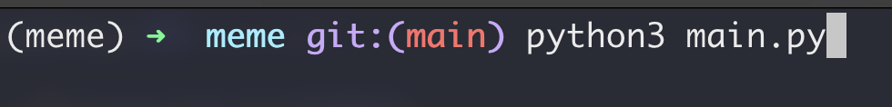
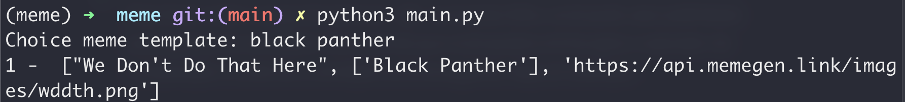
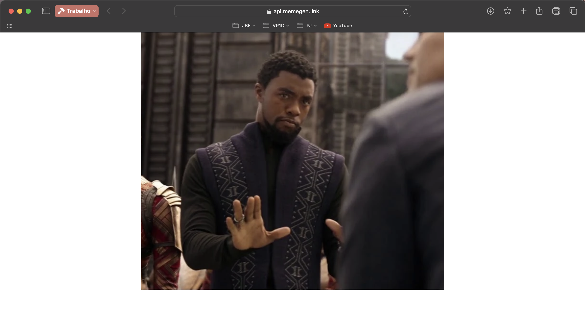
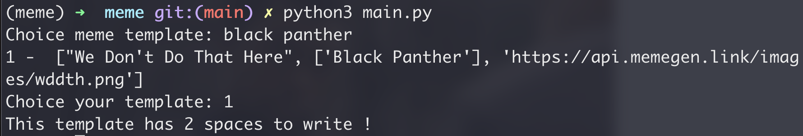
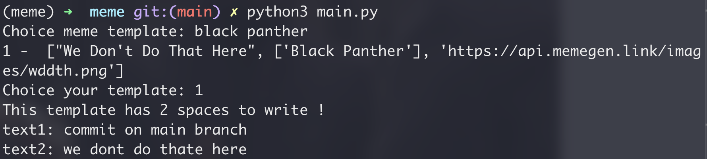
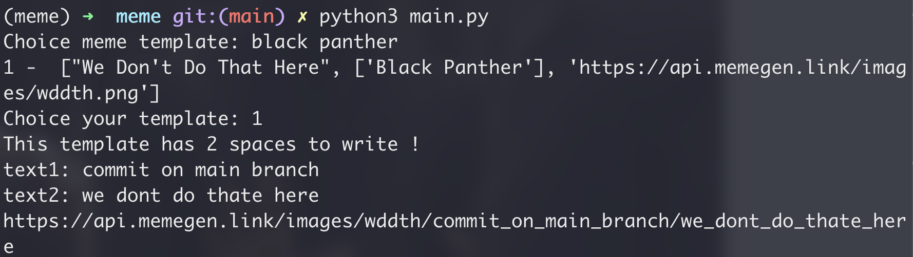
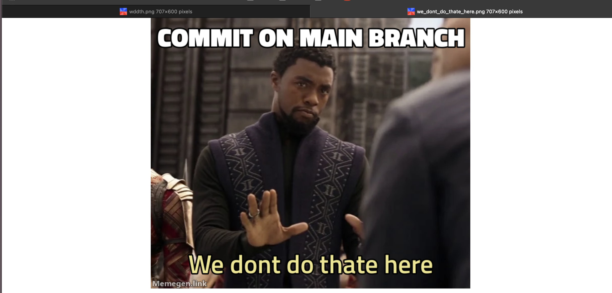

# meme

Entry in repository and run man.py:

Search for a random template you think:

Click the link below to see the templates on the enumerated list, in this case, have one template:

Choice the number of template you want and you will see the number of phrases you can write in the meme, in this case, we have 2 spaces

Write phrase per phrase based on left spaces the template have (you can only tap enter if you don't want write some space)

Now you have the link of your brand new meme made by yourself with Python !

Credits to Memegen API (https://api.memegen.link/docs) 
and follow for more !